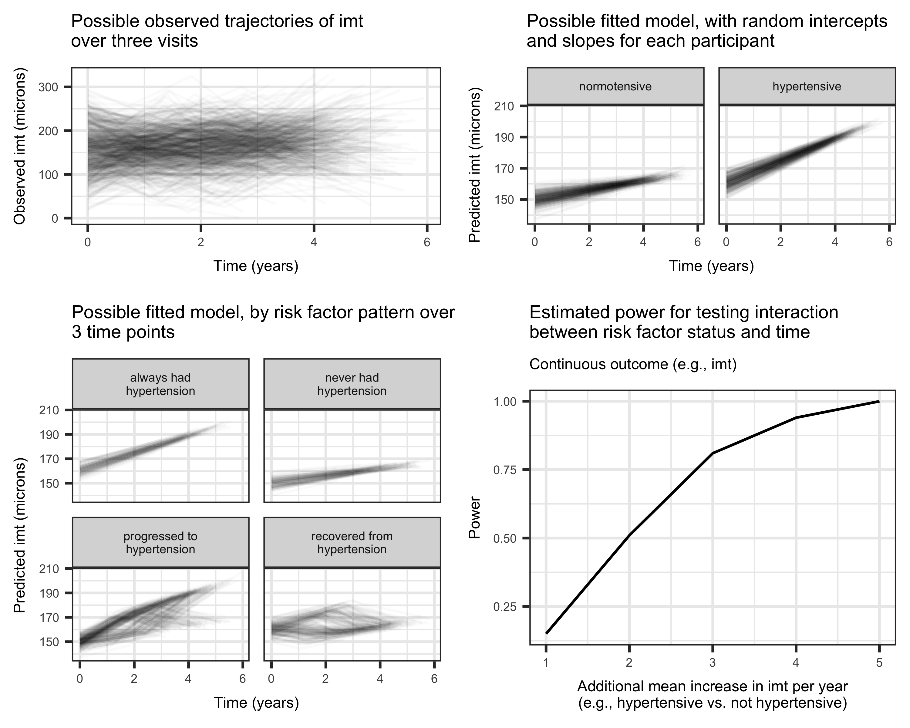

class: center, middle

# A colleague comes to you...

---

> # I have a cohort study where we have collected data at two time points. We would like to collect data at a third time point. Our key question of interest is whether changes in risk factors for CVD predict changes in subclinical markers of the disease, such as measures of atherosclerosis from imaging data.

---

> # Also, we want each participant to have a random intercept, random slope over time, and allow for non-linearity in the trajectory.

---
class: middle, center
```{r, echo=FALSE, message=FALSE, fig.width=10, fig.asp=0.6, dpi=300}
library(tidyverse)
library(cowplot)

expand.grid(visit = c("Visit 1", "Visit 2", "Visit 3"),
            trajectory = c("Constant decline", "Stable", "Stable, then decline", "Abnormal, then improves")) %>%
  as_tibble() %>%
  mutate(
    y = c(3, 2, 1, 2, 2, 2, 3, 3, 2, 1, 1, 2)
  ) %>%
  ggplot(aes(x = visit, y = y, color = trajectory, group = trajectory)) +
  geom_path(position = position_dodge(0.8)) +
  scale_color_brewer(palette = "Set1", name = "Trajectory") +
  labs(
    x = "Time",
    y = "Intermedial wall thickness",
    title = "Potential trajectories estimated for itermedial wall thickness"
  )
```


---

class: middle

* ## This collaborator was doing great work, had gotten multiple R01s and was very well-regarded in the community. It was important that this go well.
* ## It was my first time with a power calculation this complicated.
* ## So I fired up my sample size program to look for something...

---

background-image: url("https://thumbs.gfycat.com/AbandonedWetArcticseal-max-1mb.gif")
background-size: cover

---

background-image: url("https://i.pinimg.com/originals/40/4e/e8/404ee85853f8478e056eafc3dc8630ff.jpg")
background-size: cover

---

# Bioethical considerations

* ## What if we use too few?
* ## What if we use too many?

---
```{r, include=FALSE}
library(tidyverse)
library(lubridate)
```

# My experience

.middle[
* ## Defended less than `r (Sys.Date() - lubridate::as_date("2015-04-21")) %>% time_length("years") %>% ceiling()` years ago
* ## Several power calculations for R01s
    * ## AUC, competing risks (wrote my own code)
]

---
# Using fake data simulation
.middle[
* ## Identified statistical mismatch between design and desired analysis
* ## Came to understand the mixed model better
* ## Wrote code that I can refactor in the future for similar power calculations
]

---

class: center, middle, inverse

# Create data-generating model

---
class: center, middle

## $$y_{ij} = \beta_0 + \alpha_i + \textrm{time}_{ij}\beta_1 + \textrm{time}_{ij}b_i + \textrm{risk factor}_{ij}\beta_2 + \textrm{time}_{ij}\textrm{risk factor}_{ij}\beta_3 + \epsilon_{ij},$$  $\epsilon_{ij} \sim N(0, 50)$

---

# Let's make some assumptions (about things we won't vary)
```{r, eval=FALSE}
dataset <- as_tibble(
  expand.grid(
    visit = c("V1", "V2", "V3"),
    risk_factor = c(0, 1)
  )
) %>%
  group_by(visit, risk_factor) %>%
  nest() %>%
  mutate(
    random_data = 
      map(data, ~data.frame(random_intercept = rnorm(n, 0, 10),
                            random_slope = rnorm(n, 0, .5),
                            id = seq(1, n, 1),
                            years_since_last_visit = runif(n, 1, 3)) %>% as_tibble())
  )
```

---

# Generate time on study
```{r, eval=FALSE}
mutate(years_since_last_visit = if_else(visit == "V1", 
                                        0, 
                                        years_since_last_visit), 
       time = lag(years_since_last_visit, default = 0) + years_since_last_visit, 
       time_linear_spline = if_else(time <= nth(time, 2), 
                                    0, 
                                    time - nth(time, 2)))
```

---

# Generate realizations of outcome

```{r, eval=FALSE}
mutate(
    imt = rnorm(1, 
                150 + random_intercept + 
                time * 2.5 + 
                risk_factor * 10 + 
                time * risk_factor * interaction_coefficient + 
                time * random_slope, 
                50)
  ) 
```

## I ended up varying `interaction_coefficient` from 1 to 5, by increments of 1

---
class: center, middle, inverse
# Perform planned analysis on simulated datasets

---


```{r, eval=FALSE}
mutate(
    simulated_dataset = map(
      interaction_coefficient, 
      ~create_dataset(.)),
    model_fit = map(
      simulated_dataset, 
      ~lmer(imt ~ (1 + time | id) + 
                  time * risk_factor, 
            data = .)),
    interaction_pvalue = map_dbl(
      model_fit, 
      ~anova(.) %>% 
       tidy() %>% 
       dplyr::select(term, p.value) %>% 
       filter(term == "time:risk_factor") %>% 
       dplyr::select(p.value) %>% 
       as.numeric())
    )
```

---

# Evaluate power
```{r, eval=FALSE}
mutate(p_value_lt_0.1 = if_else(interaction_pvalue < 0.1, 1, 0)) %>%
  group_by(interaction_coefficient) %>%
  summarise(power = mean(p_value_lt_0.1))
```

---
class: center, middle, inverse
# Create great plots

---
class: center, middle

```{r, echo=FALSE}

```


---
class: center, middle, inverse

# Use fake data simulation when designing a study!

---
# Advantages

## * Correct power calculations for any model you can write down
## * Compare statistal tests you are considering
## * Identify issues with proposed data analysis
## * Provide example figures to investigator